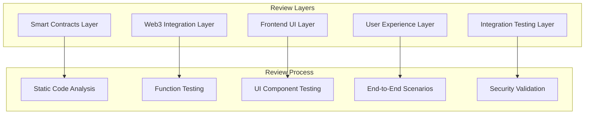

# Design Document

## Overview

This document outlines the comprehensive review design for the TreeHole decentralized payment splitter system. The review will be conducted as a systematic, file-by-file, function-by-function analysis with real user testing scenarios to ensure production-ready quality and seamless smart contract integration.

## Architecture

The review follows a layered approach covering all system components:



## Components and Interfaces

### 1. Smart Contracts Review Component

**Purpose**: Validate contract security, functionality, and gas optimization

**Key Interfaces**:
- `PaymentSplitter.sol` analysis
- `TestToken.sol` validation  
- Contract deployment verification
- Event emission testing

**Review Methods**:
```solidity
// Contract Analysis Interface
interface IContractReview {
    function analyzeSecurityPatterns() external view returns (SecurityReport);
    function validateBusinessLogic() external view returns (LogicReport);
    function testEventEmissions() external returns (EventReport);
    function measureGasUsage() external returns (GasReport);
}
```

### 2. Web3 Integration Review Component

**Purpose**: Ensure reliable blockchain connectivity and transaction handling

**Key Interfaces**:
- Wallet connection stability
- Contract interaction reliability
- Event listening accuracy
- Error handling completeness

**Review Methods**:
```javascript
// Web3 Integration Testing Interface
class Web3ReviewSuite {
    async testWalletConnection() { /* MetaMask integration */ }
    async testContractCalls() { /* Transaction execution */ }
    async testEventListening() { /* Real-time updates */ }
    async testErrorScenarios() { /* Failure handling */ }
}
```

### 3. Frontend UI Review Component

**Purpose**: Validate user interface functionality and responsiveness

**Key Interfaces**:
- Component rendering validation
- User interaction testing
- State management verification
- Responsive design testing

**Review Methods**:
```javascript
// UI Component Testing Interface
class UIReviewSuite {
    async testCountdownComponent() { /* Timer functionality */ }
    async testPaymentModal() { /* Payment confirmation */ }
    async testToastNotifications() { /* User feedback */ }
    async testResponsiveLayout() { /* Mobile/desktop */ }
}
```

### 4. User Experience Review Component

**Purpose**: Simulate real user journeys and validate UX flows

**Key Scenarios**:
- New user onboarding
- Payment execution flow
- Multi-user interaction
- Error recovery paths

## Data Models

### Review Session Model
```typescript
interface ReviewSession {
    sessionId: string;
    timestamp: Date;
    reviewType: 'contracts' | 'frontend' | 'integration' | 'e2e';
    testResults: TestResult[];
    issues: Issue[];
    recommendations: Recommendation[];
}
```

### Test Result Model
```typescript
interface TestResult {
    testName: string;
    component: string;
    status: 'pass' | 'fail' | 'warning';
    executionTime: number;
    details: string;
    evidence?: string; // Screenshots, logs, etc.
}
```

### Issue Tracking Model
```typescript
interface Issue {
    id: string;
    severity: 'critical' | 'high' | 'medium' | 'low';
    category: 'security' | 'functionality' | 'performance' | 'ux';
    description: string;
    location: string; // File path and line number
    recommendation: string;
    status: 'open' | 'in-progress' | 'resolved';
}
```

## Error Handling

### Contract Error Scenarios
1. **Insufficient Allowance**: Test ERC20 approval failures
2. **Zero Address Validation**: Verify address parameter checks
3. **Reentrancy Protection**: Validate ReentrancyGuard effectiveness
4. **Integer Overflow**: Test SafeMath implementations

### Frontend Error Scenarios
1. **Network Disconnection**: Test offline behavior
2. **Transaction Rejection**: Handle user-cancelled transactions
3. **Invalid Input**: Validate form input sanitization
4. **Contract Interaction Failures**: Test fallback mechanisms

### Integration Error Scenarios
1. **Event Listening Failures**: Test event subscription recovery
2. **State Synchronization**: Validate UI state consistency
3. **Multi-tab Behavior**: Test concurrent session handling
4. **Chain Switching**: Validate network change handling

## Testing Strategy

### Phase 1: Static Analysis (30 minutes)
- **Smart Contracts**: Solidity code review, security patterns
- **Frontend Code**: JavaScript/TypeScript analysis, best practices
- **Configuration**: Environment variables, build settings
- **Documentation**: README accuracy, setup instructions

### Phase 2: Unit Testing (45 minutes)
- **Contract Functions**: Individual function testing
- **UI Components**: Component isolation testing  
- **Utility Functions**: Helper function validation
- **State Management**: State transition testing

### Phase 3: Integration Testing (60 minutes)
- **Wallet Integration**: MetaMask connection flows
- **Contract Interaction**: Transaction execution paths
- **Event Handling**: Real-time update mechanisms
- **Error Recovery**: Failure scenario handling

### Phase 4: End-to-End Testing (90 minutes)
- **Single User Journey**: Complete payment flow
- **Multi-User Scenarios**: Payer and listener interaction
- **Edge Cases**: Boundary condition testing
- **Performance**: Load and stress testing

### Phase 5: Security Validation (45 minutes)
- **Smart Contract Security**: Vulnerability assessment
- **Frontend Security**: XSS, injection prevention
- **Private Key Safety**: Wallet security validation
- **Transaction Security**: MEV and front-running protection

## Review Execution Plan

### Pre-Review Setup
1. Environment preparation (local blockchain, test accounts)
2. Dependency installation and build verification
3. Test data preparation (token balances, addresses)
4. Monitoring tools setup (transaction logs, event listeners)

### Review Execution Matrix

| Component | Files to Review | Test Scenarios | Success Criteria |
|-----------|----------------|----------------|------------------|
| **Smart Contracts** | `PaymentSplitter.sol`, `TestToken.sol`, `Deploy.s.sol` | Payment splitting, faucet claims, deployment | All tests pass, events emit correctly, gas usage optimal |
| **Web3 Integration** | `wallet.ts`, `contracts.ts`, `faucet.ts` | Connection, transactions, event listening | Reliable connectivity, proper error handling, real-time updates |
| **UI Components** | `App.tsx`, `Countdown.tsx`, `Modal.tsx`, `Toast.tsx` | Rendering, interactions, state updates | Responsive design, smooth animations, clear feedback |
| **User Flows** | Complete application | End-to-end scenarios | Intuitive navigation, error recovery, multi-user support |

### Success Metrics

#### Functional Metrics
- **Contract Deployment**: 100% success rate on testnet
- **Transaction Success**: >95% success rate for valid transactions
- **Event Detection**: 100% accuracy in event listening
- **UI Responsiveness**: <200ms response time for user interactions

#### Security Metrics
- **Vulnerability Scan**: Zero critical/high severity issues
- **Access Control**: Proper permission validation
- **Input Validation**: 100% coverage of user inputs
- **Error Handling**: Graceful failure for all error scenarios

#### User Experience Metrics
- **Onboarding Time**: <2 minutes for new users
- **Payment Flow**: <30 seconds for complete payment
- **Error Recovery**: Clear guidance for all failure cases
- **Cross-browser**: Compatible with Chrome, Firefox, Safari

## Quality Assurance Framework

### Code Quality Standards
- **Solidity**: Follow OpenZeppelin patterns, comprehensive comments
- **JavaScript**: ESLint compliance, consistent formatting
- **TypeScript**: Strict type checking, proper interfaces
- **CSS**: Tailwind best practices, responsive design

### Testing Standards
- **Unit Tests**: >90% code coverage
- **Integration Tests**: All critical paths covered
- **E2E Tests**: Complete user journeys validated
- **Performance Tests**: Load testing under realistic conditions

### Documentation Standards
- **Code Comments**: All complex logic explained
- **API Documentation**: Complete function signatures
- **User Guides**: Step-by-step instructions
- **Troubleshooting**: Common issues and solutions

This comprehensive design ensures every aspect of the TreeHole system is thoroughly reviewed, tested, and validated for production readiness with particular focus on smart contract integration reliability.