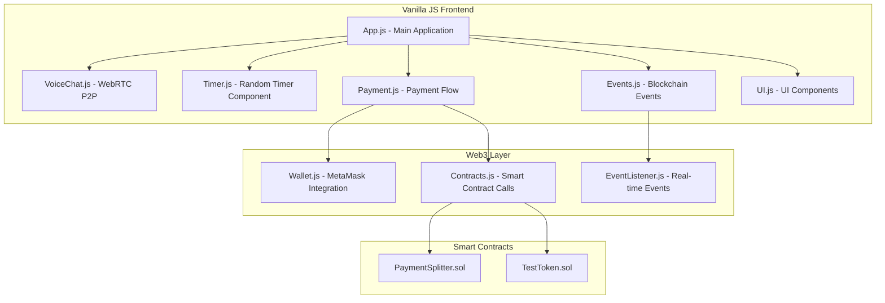

# Design Document

## Overview

This document outlines the design for migrating TreeHole from React/TypeScript to Vanilla JavaScript while adding P2P voice chat functionality. The design focuses on maintaining all existing functionality while implementing the missing features identified in the requirements analysis. The architecture will be modular, using ES6 modules to create a component-like structure without frameworks.

## Architecture

The system follows a modular Vanilla JS architecture with clear separation of concerns:



## Components and Interfaces

### 1. Main Application Component (App.js)

**Purpose**: Central application controller that orchestrates all components

**Key Responsibilities**:
- Initialize all modules and components
- Manage application state
- Coordinate between voice chat, timer, and payment systems
- Handle routing and navigation

**Interface**:
```javascript
class TreeHoleApp {
    constructor() {
        this.state = {
            isConnected: false,
            currentUser: null,
            timerState: 'stopped',
            voiceChatState: 'disconnected',
            balance: 0
        };
    }
    
    async init() { /* Initialize all components */ }
    async connectWallet() { /* MetaMask connection */ }
    updateState(newState) { /* State management */ }
    render() { /* Update UI based on state */ }
}
```

### 2. P2P Voice Chat Component (VoiceChat.js)

**Purpose**: Handle WebRTC peer-to-peer voice communication

**Key Features**:
- WebRTC connection establishment
- Audio stream management
- Connection status monitoring
- Error handling and reconnection

**Interface**:
```javascript
class VoiceChatManager {
    constructor() {
        this.localStream = null;
        this.remoteStream = null;
        this.peerConnection = null;
        this.isConnected = false;
    }
    
    async initializeAudio() { /* Get user media */ }
    async createOffer(targetPeerId) { /* Create WebRTC offer */ }
    async handleAnswer(answer) { /* Handle WebRTC answer */ }
    async handleIceCandidate(candidate) { /* Handle ICE candidates */ }
    disconnect() { /* Clean up connections */ }
    
    // Event callbacks
    onConnectionEstablished(callback) { /* Connection success */ }
    onConnectionLost(callback) { /* Connection failure */ }
    onAudioReceived(callback) { /* Remote audio stream */ }
}
```

**WebRTC Implementation Strategy**:
- Use simple-peer library for WebRTC abstraction
- Implement signaling through blockchain events (decentralized)
- Support audio-only communication initially
- Handle NAT traversal with STUN servers

### 3. Random Timer Component (Timer.js)

**Purpose**: Manage countdown timer with random duration and payment extensions

**Key Features**:
- Random duration generation (5-15 minutes)
- Real-time countdown display
- Extension through payments
- Visual and audio alerts

**Interface**:
```javascript
class RandomTimer {
    constructor() {
        this.duration = 0; // in seconds
        this.remaining = 0;
        this.isRunning = false;
        this.intervalId = null;
    }
    
    generateRandomDuration() { /* 5-15 minutes random */ }
    start() { /* Begin countdown */ }
    pause() { /* Pause timer */ }
    reset() { /* Reset with new random time */ }
    extend(minutes) { /* Add time from payment */ }
    
    // Event callbacks
    onTick(callback) { /* Every second update */ }
    onTimeUp(callback) { /* Timer reaches zero */ }
    onExtended(callback) { /* Time extended via payment */ }
}
```

### 4. Payment System Component (Payment.js)

**Purpose**: Handle payment flow with confirmation dialogs and real-time updates

**Key Features**:
- Payment confirmation dialog (alarm-style)
- Dynamic cost calculation
- ±10 minute adjustment controls
- Transaction execution and monitoring

**Interface**:
```javascript
class PaymentManager {
    constructor(contractsManager, eventManager) {
        this.contracts = contractsManager;
        this.events = eventManager;
        this.costPerMinute = 1; // 1 token per minute
    }
    
    calculateCost(minutes) { /* Calculate total cost */ }
    showPaymentDialog(listenerAddress, minutes) { /* Show confirmation */ }
    async executePayment(listenerAddress, amount) { /* Execute approve + payAndSplit */ }
    
    // UI Methods
    renderPaymentForm() { /* Render payment controls */ }
    renderConfirmationDialog() { /* Alarm-style confirmation */ }
    showToast(message, type) { /* Success/error notifications */ }
}
```

### 5. Event Management Component (Events.js)

**Purpose**: Handle real-time blockchain event listening and UI updates

**Key Features**:
- PaymentProcessed event detection
- Real-time UI updates
- Multi-tab synchronization
- Connection monitoring

**Interface**:
```javascript
class EventManager {
    constructor(web3Provider) {
        this.provider = web3Provider;
        this.eventListeners = new Map();
        this.isListening = false;
    }
    
    async startListening() { /* Begin event monitoring */ }
    stopListening() { /* Stop event monitoring */ }
    
    // Event handlers
    onPaymentProcessed(callback) { /* Payment split event */ }
    onTokenTransfer(callback) { /* Token transfer event */ }
    
    // Multi-tab synchronization
    broadcastToTabs(eventData) { /* Broadcast via localStorage */ }
    listenToTabs(callback) { /* Listen to other tabs */ }
}
```

### 6. UI Components (UI.js)

**Purpose**: Reusable UI components and utilities

**Key Components**:
- Toast notification system
- Modal dialogs
- Loading spinners
- Form controls

**Interface**:
```javascript
class UIComponents {
    static createToast(message, type, duration = 5000) { /* Toast notifications */ }
    static createModal(title, content, actions) { /* Modal dialogs */ }
    static createLoadingSpinner() { /* Loading indicators */ }
    static createButton(text, onClick, className) { /* Styled buttons */ }
    
    // Specialized components
    static createPaymentDialog(data) { /* Alarm-style payment confirmation */ }
    static createListenerPrompt(data) { /* Listener acceptance prompt */ }
    static createTimerDisplay(time) { /* Timer visualization */ }
}
```

## Data Models

### Application State Model
```javascript
const AppState = {
    // User connection
    wallet: {
        isConnected: false,
        address: null,
        balance: 0,
        network: null
    },
    
    // Timer state
    timer: {
        duration: 0,
        remaining: 0,
        isRunning: false,
        lastStartTime: null
    },
    
    // Voice chat state
    voiceChat: {
        isConnected: false,
        localStream: null,
        remoteStream: null,
        peerId: null
    },
    
    // Payment state
    payment: {
        isProcessing: false,
        lastTransaction: null,
        pendingExtensions: []
    },
    
    // UI state
    ui: {
        activeModal: null,
        toasts: [],
        isLoading: false
    }
};
```

### Payment Transaction Model
```javascript
const PaymentTransaction = {
    id: String,
    timestamp: Date,
    payer: String,
    listener: String,
    amount: Number,
    extensionMinutes: Number,
    txHash: String,
    status: 'pending' | 'confirmed' | 'failed',
    blockNumber: Number
};
```

### Voice Chat Session Model
```javascript
const VoiceChatSession = {
    sessionId: String,
    participants: [String], // Wallet addresses
    startTime: Date,
    endTime: Date,
    totalExtensions: Number,
    totalPayments: Number,
    status: 'active' | 'ended' | 'paused'
};
```

## Error Handling

### Payment Error Scenarios
1. **Insufficient Balance**: Check balance before showing payment dialog
2. **Transaction Rejection**: Handle user cancellation gracefully
3. **Network Errors**: Retry mechanism with exponential backoff
4. **Contract Errors**: Parse and display specific error messages

```javascript
class ErrorHandler {
    static handlePaymentError(error) {
        if (error.code === 4001) {
            return "Payment cancelled by user";
        } else if (error.message.includes("insufficient")) {
            return "Insufficient token balance";
        } else if (error.message.includes("network")) {
            return "Network connection error";
        }
        return `Transaction failed: ${error.message}`;
    }
    
    static handleVoiceChatError(error) {
        if (error.name === 'NotAllowedError') {
            return "Microphone access denied. Please allow microphone access.";
        } else if (error.name === 'NotFoundError') {
            return "No microphone found. Please connect a microphone.";
        }
        return `Voice chat error: ${error.message}`;
    }
}
```

### Voice Chat Error Scenarios
1. **Microphone Access Denied**: Request permission with clear instructions
2. **WebRTC Connection Failed**: Fallback to different STUN servers
3. **Audio Stream Lost**: Automatic reconnection attempts
4. **Peer Disconnection**: Clean up resources and notify user

### Event Listening Error Scenarios
1. **Connection Lost**: Automatic reconnection with visual indicator
2. **Event Parsing Failed**: Log error and continue listening
3. **Multi-tab Conflicts**: Use localStorage for synchronization
4. **Provider Errors**: Switch to backup provider if available

## Testing Strategy

### Unit Testing Approach
- Test each component in isolation
- Mock external dependencies (Web3, WebRTC)
- Use Jest for testing framework
- Achieve >90% code coverage

### Integration Testing Scenarios
1. **Complete Payment Flow**: Wallet connection → Payment → Timer extension
2. **Voice Chat Integration**: Audio connection → Payment during call → Extension
3. **Multi-user Testing**: Two accounts testing payment splitting
4. **Event Synchronization**: Real-time updates across multiple tabs

### Browser Compatibility Testing
- Chrome (primary target)
- Firefox (secondary)
- Safari (tertiary)
- Mobile browsers (responsive design)

## Migration Strategy

### Phase 1: Project Setup (Day 1)
1. Create new Vite project with vanilla-js template
2. Setup build configuration and development server
3. Migrate existing CSS/styling to new structure
4. Setup basic HTML structure

### Phase 2: Core Components Migration (Days 2-3)
1. Convert React components to Vanilla JS modules
2. Implement state management without Redux/Context
3. Migrate Web3 integration layer
4. Setup event system for component communication

### Phase 3: Enhanced Features (Days 4-5)
1. Implement WebRTC voice chat functionality
2. Add random timer with proper controls
3. Create alarm-style payment confirmation dialogs
4. Implement toast notification system

### Phase 4: Real-time Features (Day 6)
1. Implement blockchain event listening
2. Add multi-tab synchronization
3. Create listener acceptance/decline flow
4. Add real-time UI updates

### Phase 5: Testing and Polish (Day 7)
1. Comprehensive testing with two accounts
2. Error handling and edge cases
3. Performance optimization
4. Documentation and deployment

## Performance Considerations

### Bundle Size Optimization
- Use tree-shaking with Vite
- Lazy load WebRTC components
- Minimize external dependencies
- Optimize images and assets

### Runtime Performance
- Efficient DOM manipulation
- Debounced event handlers
- Memory leak prevention
- Smooth animations with CSS transitions

### Network Optimization
- Batch blockchain calls where possible
- Implement caching for contract data
- Use WebSocket for real-time events
- Optimize WebRTC connection establishment

This design provides a comprehensive roadmap for migrating TreeHole to Vanilla JavaScript while adding all the missing features identified in the requirements analysis. The modular architecture ensures maintainability while the detailed interfaces provide clear implementation guidance.