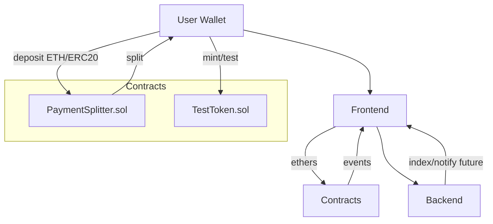
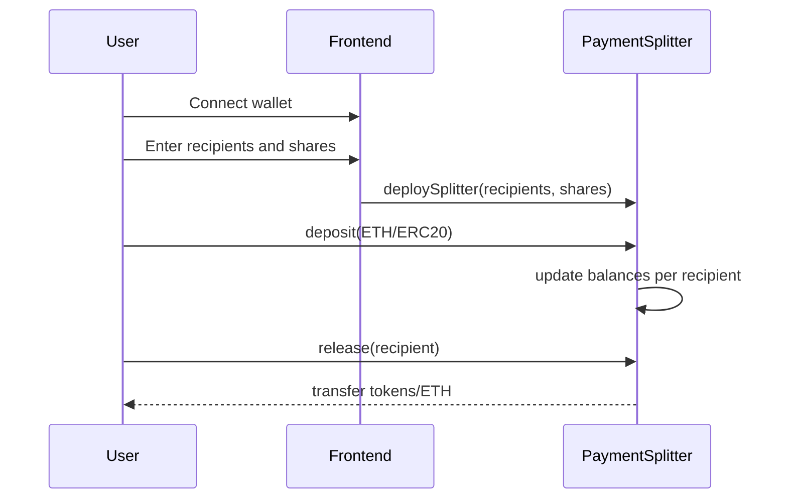

<div align="center">

# Treehole — Payment Splitter DApp (EthOnline 2025)

Effortless, transparent revenue sharing for teams, DAOs, and creators.

</div>

---

### Why Treehole?

Teams ship together but get paid separately. Web3 makes splitting trustless, yet most tools are clunky or opaque. Treehole delivers an elegant, auditable flow to deposit funds and instantly split them among stakeholders with a great user experience and no surprises.

## TL;DR

- **Problem**: Manual revenue sharing is error-prone, slow, and non-transparent.
- **Solution**: A smart contract–backed splitter with a clean UI and countdown-based flows for time-bound events (e.g., campaign end → distribute).
- **For Judges**: Run the scripts below, open the app, deposit tokens/ETH, and see instant, verifiable splits. Architecture and security choices are documented with diagrams.

## Architecture Overview



### Sequence: Deposit and Split



## Features

- **Trustless revenue sharing** for ETH and ERC‑20.
- **Countdown flows** for time-boxed releases (e.g., accept funds until T, then enable claim).
- **Gas- and UX-optimized** interactions with clear states and toasts.
- **No backend required**; optional services can index events or notify users later.

## Project Structure

- `contracts/` — Foundry (Solidity)
- `frontend/` — Vite + Vanilla JS + Tailwind CSS
- `scripts/` — Dev and deployment helpers
- `backend/` — Optional Node server (future indexing/notifications)

## User Experience Highlights

- **One-screen flow**: connect, configure recipients/shares, deposit, distribute.
- **Clarity by design**: real-time balances, pending/claimable states, explicit error toasts.
- **Accessibility**: keyboard-first flows, high-contrast, responsive layout.
- **Defense-in-depth UX**: confirmations for value-affecting actions, network and chain guards.

### Demo Flow (What to Show in Judging)

1. Connect wallet on testnet.
2. Create a splitter with 3 recipients and custom shares.
3. Deposit test ETH or use `TestToken`.
4. Trigger countdown end (or skip) and call release/claim.
5. Show on-chain events and matching UI state.

## Getting Started

### Prerequisites

- Foundry (`forge`), `bun`, Node 18+

### Contracts

```bash
cd contracts
forge build
forge test -vvv
```

### Frontend

```bash
cd frontend
bun install
bun run dev
```

### Local Development End-to-End

```bash
# 1) Start local chain (Anvil)
bash scripts/dev-anvil.sh

# 2) Deploy contracts (reads network config inside the script)
bash scripts/deploy-testnet.sh

# 3) Sync ABI into frontend/public/abi
node scripts/sync-abi.js

# 4) Launch the web app
bash scripts/start-web.sh
```

If you use a testnet instead of local Anvil, make sure your wallet is on the same chain as configured in `frontend/src/chains.js` and `frontend/src/contracts.js`.

## Smart Contracts

- `PaymentSplitter.sol`: Holds deposits and computes each recipient’s claim based on predefined shares. Supports ETH and ERC‑20. Emits events for UI syncing.
- `TestToken.sol`: Simple ERC‑20 for local testing and demo funding.

### Security Considerations

- Pull-based withdrawals reduce reentrancy surfaces; external calls are minimized.
- Follows checks-effects-interactions; uses well-audited interfaces.
- No private keys in repo; deploy via environment variables and local wallets.
- Extensive unit tests in `contracts/test/`.

## Frontend

- Vite + Vanilla JS for speed, Tailwind for consistent design, and ethers/wagmi-like primitives.
- Key modules:
  - `src/wallet.js`: wallet connection and chain guards
  - `src/ui/*.js`: dialogs, toasts, and feedback
  - `src/countdown/*`: countdown state and view

## Optional Backend (Future)

The app works fully client-side. A minimal Node service can later index events, cache views, send webhooks/notifications, and serve mobile clients.


## Testing

```bash
cd contracts
forge test -vvv
```

## Roadmap

- Batch release for many recipients in one tx
- Role-based administration (owner/operator)
- Rich analytics and history views
- Email/Push notifications via optional backend

## Acknowledgements

Built for EthOnline 2025. Thanks to the organizers, mentors, and community.

---

## Deployed Contracts (Testnets)

### Sepolia
- TestToken: `0xB176c1FA7B3feC56cB23681B6E447A7AE60C5254`  
  Explorer: https://sepolia.etherscan.io/address/0xB176c1FA7B3feC56cB23681B6E447A7AE60C5254 (Verified)
- PaymentSplitter: `0x76d81731e26889Be3718BEB4d43e12C3692753b8`  
  Explorer: https://sepolia.etherscan.io/address/0x76d81731e26889be3718beb4d43e12c3692753b8 (Verified)

### BNB Testnet
- TestToken: `0xB176c1FA7B3feC56cB23681B6E447A7AE60C5254`  
  Explorer: https://testnet.bscscan.com/address/0xB176c1FA7B3feC56cB23681B6E447A7AE60C5254 (Verified)
- PaymentSplitter: `0x76d81731e26889Be3718BEB4d43e12C3692753b8`  
  Explorer: https://testnet.bscscan.com/address/0x76d81731e26889be3718beb4d43e12c3692753b8 (Verified)

Notes:
- Environment variables like `PRIVATE_KEY` and RPC URLs must be set locally; `.env` is gitignored and should never be committed.
