# TreeHole - Pay to Listen, Pay to Extend Time

A decentralized application (dApp) that allows users to pay for listening sessions and extend time through blockchain payments. Built for EthOnline 2025.

## 🎯 Project Overview


## 🚀 Features

- **Smart Contract Integration**: Secure payment splitting using Solidity contracts
- **Real-time Timer**: Interactive countdown with extension capabilities
- **Web3 Wallet Integration**: MetaMask support for seamless transactions
- **Modern UI**: Beautiful, responsive interface built with React and Tailwind CSS
- **Test Token Faucet**: Easy token claiming for testing purposes

## 🏗️ Architecture

### System Overview


### Smart Contracts (Foundry)

- **TestToken.sol**: ERC-20 token with faucet functionality
- **PaymentSplitter.sol**: Handles payment splitting (50% listener, 50% treasury)

### Frontend (React + TypeScript)

- **Web3 Integration**: Ethers.js for blockchain interactions
- **UI Components**: Countdown timer, payment modal, toast notifications
- **Wallet Management**: MetaMask connection and account handling

### Backend (Express.js)

- **Optional Server**: Basic health check endpoint
- **Future Ready**: Prepared for webhook integrations and user preferences

## 📋 Prerequisites

- Node.js (v18+)
- Foundry (for smart contracts)
- MetaMask browser extension
- Git

## 🛠️ Installation & Setup

### 1. Clone the Repository

```bash
git clone <repository-url>
cd Treehole
```

### 2. Smart Contracts Setup

```bash
cd contracts
forge install
forge build
forge test
```

### 3. Frontend Setup

```bash
cd frontend
npm install
npm run build
```

### 4. Backend Setup (Optional)

```bash
cd backend
npm install
npm start
```

## 🚀 Running the Application

### Local Development

1. **Start Anvil (Local Blockchain)**

```bash
anvil --port 8545
```

2. **Deploy Contracts**

```bash
cd contracts
forge script script/Deploy.s.sol --rpc-url http://localhost:8545 --broadcast --private-key 0xac0974bec39a17e36ba4a6b4d238ff944bacb478cbed5efcae784d7bf4f2ff80
```

3. **Start Frontend**

```bash
cd frontend
npm run dev
```

4. **Access Application**
   Open http://localhost:5173 in your browser

### Production Deployment

1. **Deploy to Testnet**

```bash
cd contracts
forge script script/Deploy.s.sol --rpc-url <testnet-rpc-url> --broadcast --verify
```

2. **Update Contract Addresses**
   Update addresses in `frontend/src/web3/contracts.ts`

3. **Build and Deploy Frontend**

```bash
cd frontend
npm run build
# Deploy dist/ folder to your hosting service
```

## 🧪 Testing

### Smart Contract Tests

```bash
cd contracts
forge test -vv
```

### Integration Testing

```bash
# Start Anvil
anvil --port 8545

# Deploy contracts
forge script script/Deploy.s.sol --rpc-url http://localhost:8545 --broadcast

# Test with cast commands
cast call <token-address> "name()" --rpc-url http://localhost:8545
cast send <token-address> "claimFaucet()" --private-key <private-key> --rpc-url http://localhost:8545
```

## 📱 User Guide

### Getting Started

1. **Connect Wallet**: Click "Connect Wallet" and approve MetaMask connection
2. **Claim Tokens**: Use the faucet to get 1000 THT test tokens
3. **Start Timer**: Begin your listening session
4. **Extend Time**: Pay tokens to extend the session for another user

### Payment Flow


### Payment Steps
1. Enter listener address
2. Set extension minutes (use +/- buttons)
3. Review total cost
4. Confirm payment (2 transactions: approve + pay)
5. Timer extends automatically

## 🔧 Configuration

### Contract Addresses

Update in `frontend/src/web3/contracts.ts`:

```typescript
export const CONTRACT_ADDRESSES = {
  testToken: "0x...",
  paymentSplitter: "0x...",
};
```

### Network Configuration

Add network details in `contracts/foundry.toml`:

```toml
[rpc_endpoints]
sepolia = "https://sepolia.infura.io/v3/YOUR_KEY"
```

## 🛡️ Security Features

### Security Architecture


### Security Measures
- **ReentrancyGuard**: Prevents reentrancy attacks
- **SafeERC20**: Secure token transfers
- **Input Validation**: Comprehensive parameter checking
- **Event Logging**: Transparent transaction tracking

## 📊 Smart Contract Details

### Contract Architecture


### TestToken Contract

- **Name**: TreeHole Token
- **Symbol**: THT
- **Decimals**: 18
- **Faucet Amount**: 1000 THT
- **Functions**: `claimFaucet()`, `mint()`, standard ERC-20

### PaymentSplitter Contract

- **Split Ratio**: 50% listener, 50% treasury
- **Security**: ReentrancyGuard protection
- **Events**: PaymentProcessed with full details
- **Functions**: `payAndSplit(token, listener, amount, time)`

## 🎯 Two-Account Testing

To test the complete flow with two users:

1. **User A (Payer)**:

   - Connect wallet
   - Claim faucet tokens
   - Start timer
   - Pay to extend for User B

2. **User B (Listener)**:
   - Connect different wallet
   - Receive payment notification
   - Timer extends automatically

## 🚀 Production Checklist

### Development Workflow


- [x] Smart contracts tested and audited
- [x] Frontend builds successfully
- [x] Web3 integration working
- [x] Payment flow tested
- [x] Error handling implemented
- [x] Responsive design
- [x] Security measures in place
- [x] Documentation complete

## 📈 Future Enhancements

### Technology Roadmap

```mermaid
timeline
    title TreeHole Development Timeline
    
    section Phase 1 ✅
        Smart Contracts    : PaymentSplitter
                           : TestToken
                           : Security Features
    
    section Phase 2 ✅
        Frontend          : React UI
                           : Web3 Integration
                           : MetaMask Support
    
    section Phase 3 🔄
        Real-time Events  : WebSocket Integration
                           : Live Updates
                           : Event Streaming
    
    section Phase 4 📋
        User Profiles     : Persistent Preferences
                           : Payment History
                           : Analytics Dashboard
    
    section Phase 5 🚀
        Multi-token       : ERC-20 Support
                           : Mobile App
                           : Advanced Features
```



### Planned Features
- **Real-time Events**: WebSocket integration for live updates
- **User Profiles**: Persistent user preferences
- **Payment History**: Transaction history tracking
- **Multi-token Support**: Support for different ERC-20 tokens
- **Mobile App**: React Native version
- **Analytics Dashboard**: Usage statistics and insights

## 🤝 Contributing

### Contribution Workflow

```mermaid
gitgraph
    commit id: "Initial Commit"
    branch develop
    checkout develop
    commit id: "Add Feature A"
    commit id: "Add Feature B"
    checkout main
    merge develop
    commit id: "Release v1.0"
    branch feature/new-feature
    checkout feature/new-feature
    commit id: "Work on Feature"
    commit id: "Fix Bug"
    checkout main
    merge feature/new-feature
    commit id: "Release v1.1"
```

### How to Contribute
1. Fork the repository
2. Create a feature branch
3. Make your changes
4. Add tests
5. Submit a pull request

## 📄 License

MIT License - see LICENSE file for details

## 🆘 Support

For issues and questions:

- Create an issue on GitHub
- Check the documentation
- Review the test files for examples

---

**Built with ❤️ for EthOnline 2025**

_Pay to Listen. Pay to Extend Time._

## 📊 Project Status


### ✅ Completed
- Smart Contracts (PaymentSplitter, TestToken)
- Frontend (React + TypeScript + Web3)
- Backend (Express.js)
- Testing (Unit + Integration)
- Documentation (README + Contributing)
- Security (ReentrancyGuard + SafeERC20)
- Deployment Scripts

### 🔄 In Progress
- Real-time event streaming
- Advanced analytics

### 📋 Planned
- Mobile application
- Multi-token support
- User profiles
- Payment history
